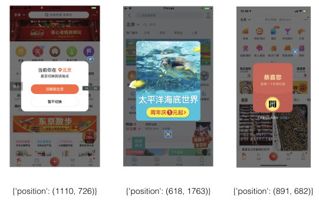

[](https://www.travis-ci.org/Meituan-Dianping/vision)


> A R-CNN (Region-based Convolutional Neural Networks) machine learning model for handling pop-up window in mobile apps.

## Mobile UI Recognition

**Vision** is a machine learning model that identifies the UI element that closes the Pop-up window and return its UI coordinate (x, y) on the screen.

A typical usage scenario would be:
- In mobile testing, when using [Appium](http://appium.io/) or similar framework for UI automation, it is usually very tricky to locate the components on the Pop-up window which is rendered on top of the current screen.

- Input a mobile App screenshot with the Pop-up, and you will get the predicted result (as shown in the blue box).



## Requirements

Python3.5 or higher

```bash
pip install  -r requirements.txt
```

## Usage
You can use Vision with a pre-trained model in "model/trained_model_1.h5", the number in the file name
is for version control, you can update it in file named "all_config".

There are two ways of using Vision.

### Predict a image with Python script

1. Update your file path in "rcnn_predict.py"

```python
model_predict("path/to/image.png", view=True)
```

2. Run script and you will get the result

```bash
python rcnn_predict.py
```

### Predict a image with a web server

1. Start the web server

```bash
python vision_server.py
```

2. Post image to web server

```bash
curl  http://localhost:9092/client/vision  -F "file=@path_to_image.png"
```

3. The response from the web server will have the coordinate or the UI element, alone with a value of score 0 or 1.0 (0 means not found, 1.0 means found).

```json
{
  "code": 0,
  "data": {
    "position": [
      618,
      1763
    ],
    "score": 1.0
  }
}
```

## Train your own model
- You can choose to use your train image if your close button has different feature from the given training set. Just take a screenshot and put it in the "image/" folder

- Rename the train image with prefix "1" for close button and "0" for background.

- You can refer to the given training images in the repo for examples.

Button image named 1_1.png:


Background image named 0_3.png:


1. There are some images in this repo for training.

```
0_0.png 0_1.png 0_2.png 0_3.png 0_4.png 0_5.png 0_6.png 1_0.png 1_1.png 1_2.png 1_3.png 1_4.png 1_5.png 1_6.png
```

2. Get augmentation of your image, run method in "rcnn_train.py"

```python
Image().get_augmentation()
```

3. Train your image, run method in "rcnn_train.py"

```python
train_model()
```

## Model layers and params

### Model layers

- Model input image will be processed from 3d to 1d and pixel value will be set to 255 or 0, which makes the model has great classification.
- There are 5 layers and the 196,450 parameters in total, which is a light model and makes the training easier and the model is also robust for different Pop-up windows.

```
_________________________________________________________________
Layer (type)                 Output Shape              Param #   
=================================================================
conv2d_1 (Conv2D)            (None, 48, 48, 32)        320       
_________________________________________________________________
conv2d_2 (Conv2D)            (None, 46, 46, 32)        9248      
_________________________________________________________________
max_pooling2d_1 (MaxPooling2 (None, 23, 23, 32)        0         
_________________________________________________________________
conv2d_3 (Conv2D)            (None, 21, 21, 64)        18496     
_________________________________________________________________
max_pooling2d_2 (MaxPooling2 (None, 10, 10, 64)        0         
_________________________________________________________________
conv2d_4 (Conv2D)            (None, 8, 8, 64)          36928     
_________________________________________________________________
max_pooling2d_3 (MaxPooling2 (None, 4, 4, 64)          0         
_________________________________________________________________
dropout_1 (Dropout)          (None, 4, 4, 64)          0         
_________________________________________________________________
flatten_1 (Flatten)          (None, 1024)              0         
_________________________________________________________________
dense_1 (Dense)              (None, 128)               131200    
_________________________________________________________________
dense_2 (Dense)              (None, 2)                 258       
=================================================================

Total params: 196,450
Trainable params: 196,450
Non-trainable params: 0
```

### Training params
In all_config.py we have training params of batch_size and epochs
- **batch_size** is the  number of training image
for updating the model
- **epochs** is the number for training the model with all the training image.


## Performance
With CPU of corei7@2.2Ghz:

- Training a model takes 30s with 10 epochs
- A mobile Pop-up window screen shot with 1080p takes 10s for calculating.


## Reference

The R-CNN model refers to this [paper](https://arxiv.org/pdf/1311.2524.pdf).
